# ✈️ Travelies - Travel Booking Website

Travelies is a modern and fully responsive travel booking website built using **HTML, CSS, and JavaScript**. It provides users with an engaging platform to explore destinations, search travel packages, manage wishlists, track booked trips, and enjoy a seamless travel planning experience across desktop, tablet, and mobile devices.

---

# ✈️ Travelies - Travel Booking Website

🌐 Live Demo:
https://meghana1125-ui.github.io/travelies-travel-booking-website/

📂 GitHub Repository:
https://github.com/Meghana1125-ui/travelies-travel-booking-website

---


## 🌍 Project Overview

Travelies is designed to simplify travel planning by offering:

- Destination exploration
- Travel package browsing
- Wishlist management
- Trip booking and tracking
- Destination search functionality
- Customer testimonials
- FAQ section
- Contact and support section
- Live location integration
- Fully responsive design

---

## 🚀 Features

### 🏠 Home Page
- Attractive hero section
- Responsive navigation bar
- Mobile hamburger menu
- Smooth scrolling experience

### 🌎 Destinations
- Explore popular travel destinations
- Destination cards with images and details
- Destination information modal popup

### 🎒 Travel Packages
- Browse available travel packages
- Package pricing and information
- Interactive package cards

### 🔍 Search Functionality
- Search destinations instantly
- Handles invalid searches gracefully
- Dynamic search results

### ❤️ Wishlist
- Add destinations to wishlist
- Remove destinations from wishlist
- Empty wishlist state

### 🧳 My Trips
- View booked trips
- Manage trip history
- Empty trip state handling

### 📅 Booking System
- User-friendly booking form
- Destination selection
- Travel date selection
- Booking confirmation workflow

### 💬 Testimonials
- Customer review section
- Interactive testimonial cards

### ❓ FAQ Section
- Frequently asked questions
- Accordion-style interaction

### 📍 Live Location
- Integrated map section
- Location display functionality

### 📞 Contact Section
- Contact form
- User inquiry support
- Clean and responsive design

### 📱 Responsive Design
- Desktop view
- Tablet view
- Mobile view
- Responsive footer
- Responsive navigation menu

---

## 🛠️ Technologies Used

- HTML5
- CSS3
- JavaScript (ES6)
- Local Storage
- Google Maps Integration

---

## 📂 Project Structure

```text
Travelies/
│
├── home.html
├── favorites.html
├── my-trips.html
│
├── css/
│   ├── travel-ui.css
│   ├── mobile.css
│   └── effects.css
│
├── js/
│   ├── app.js
│   ├── modal.js
│   ├── search.js
│   ├── favorites.js
│   ├── weather.js
│   └── validation.js
│
├── images/
│
└── screenshots/
```

---

## 📸 Screenshots

### Home Page
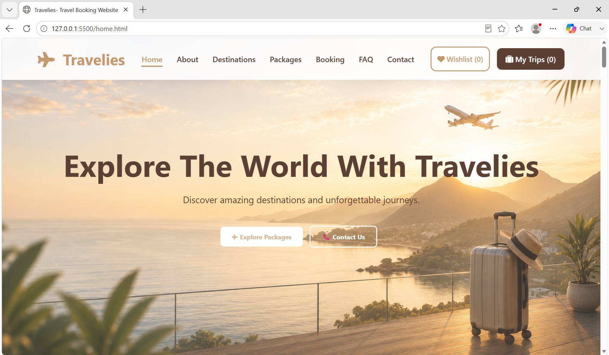

### About Section
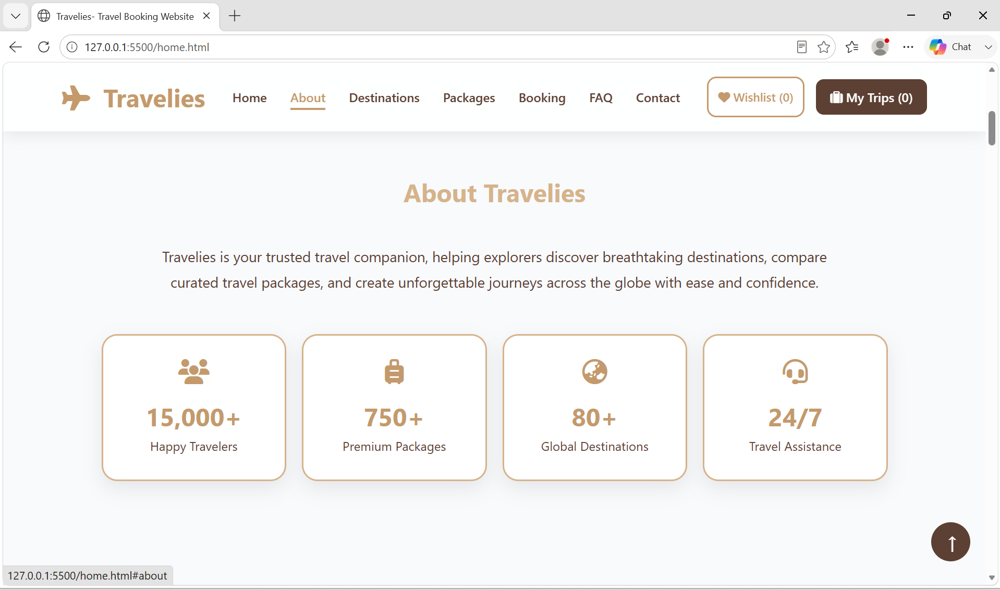

### Destinations Section
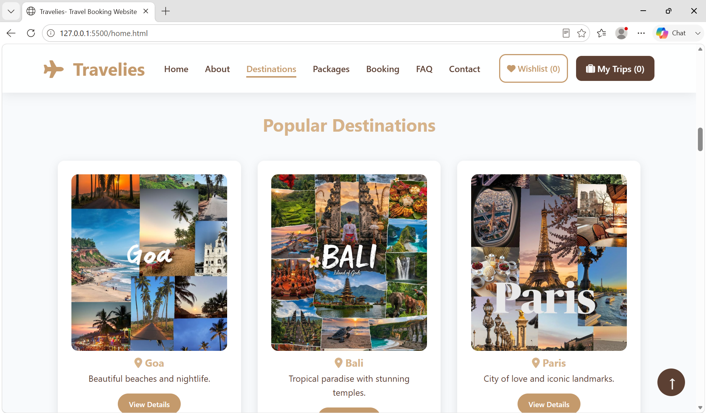

### Destination Details
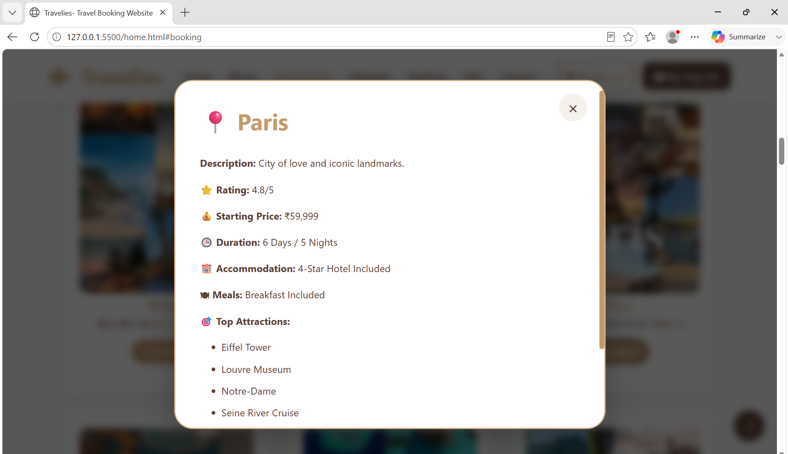

### Packages Section
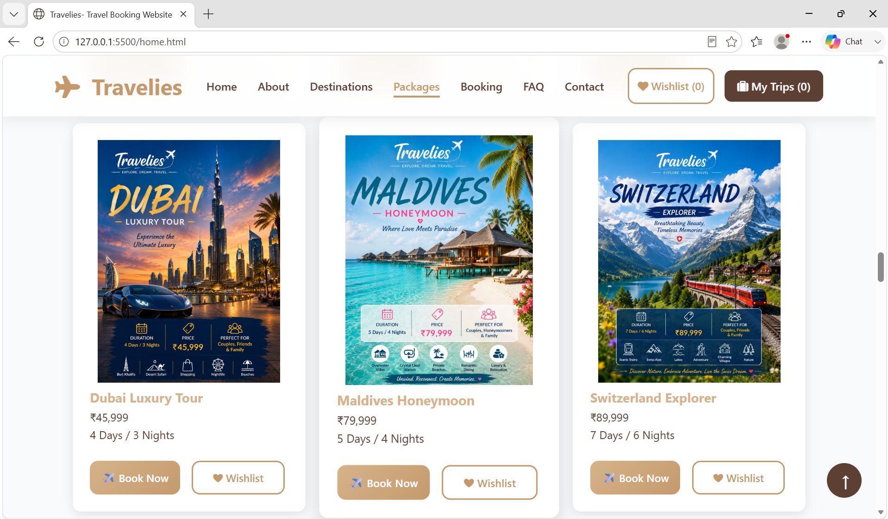

### Search Feature
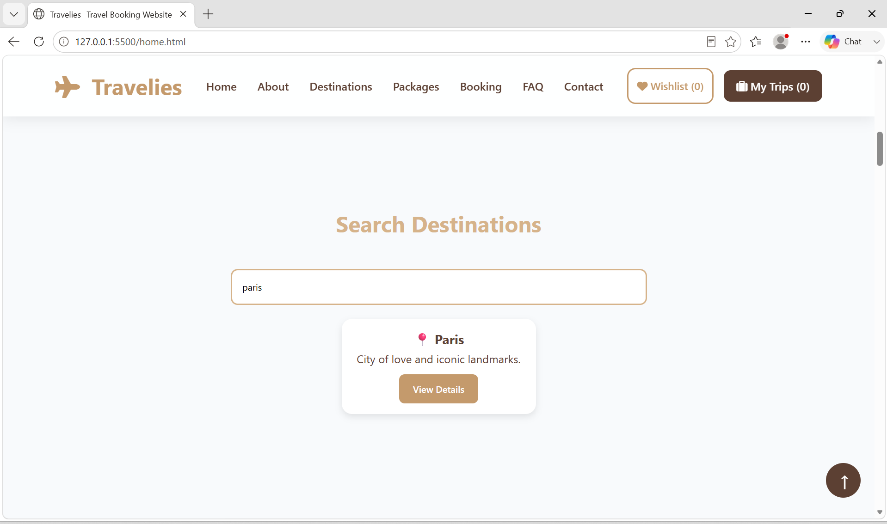

### Booking Section
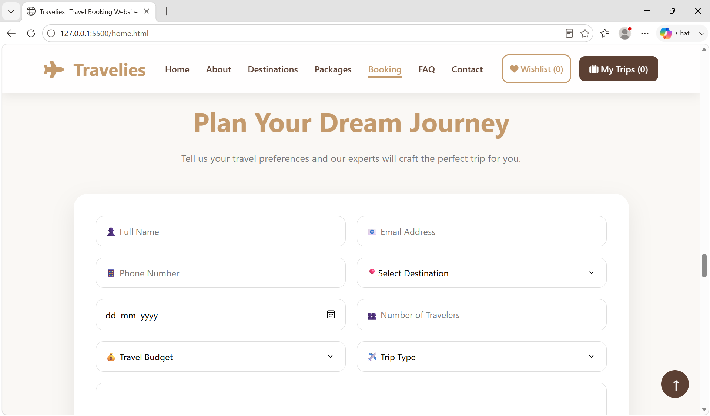

### Contact Section
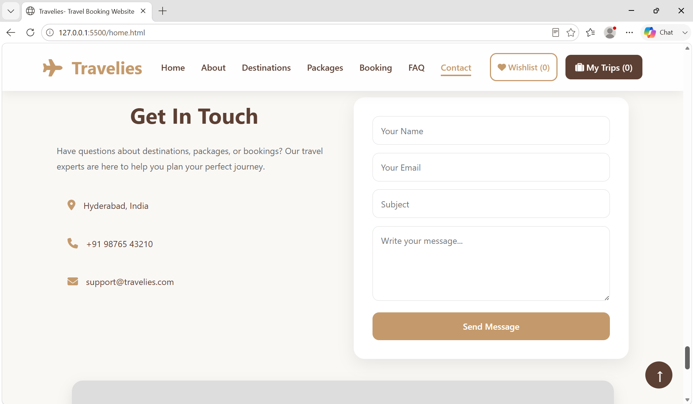

### Testimonials
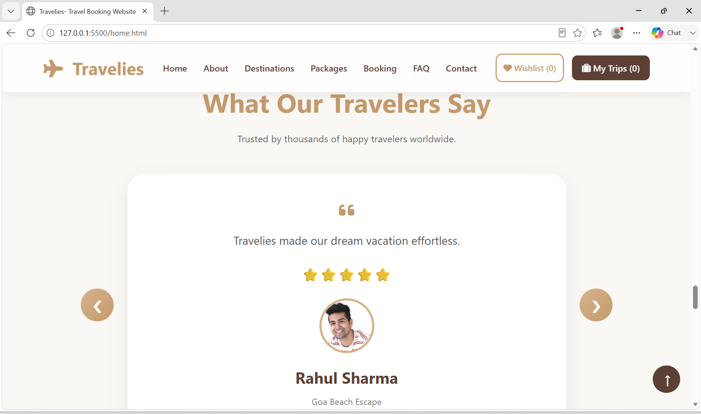

### FAQ Section
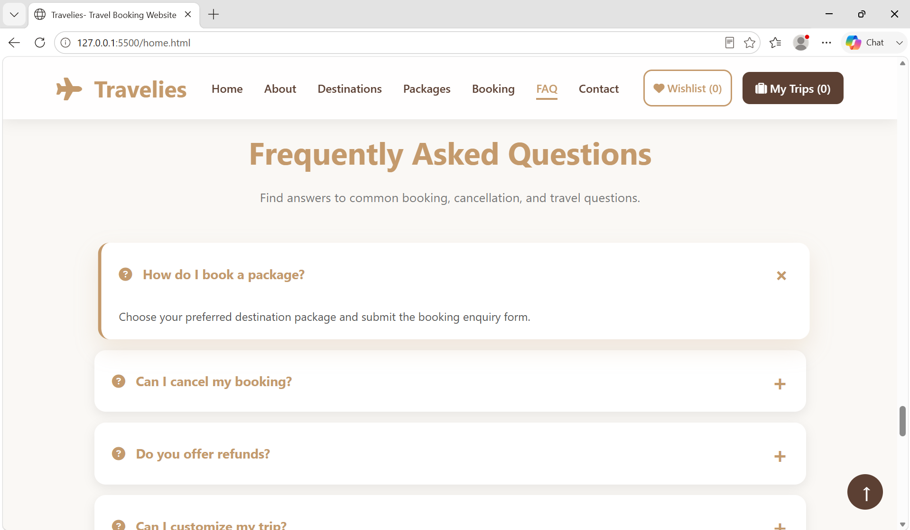

### Wishlist
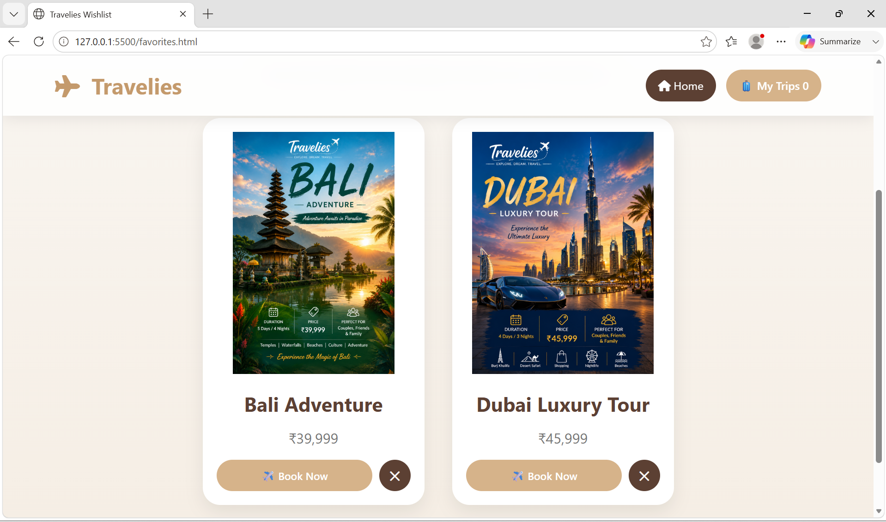

### My Trips
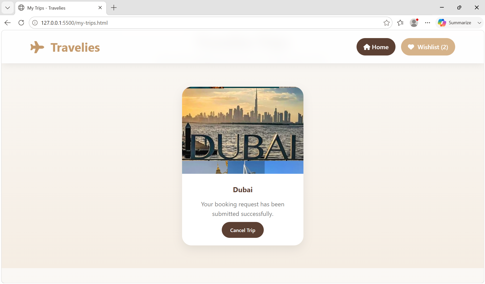

### Mobile View
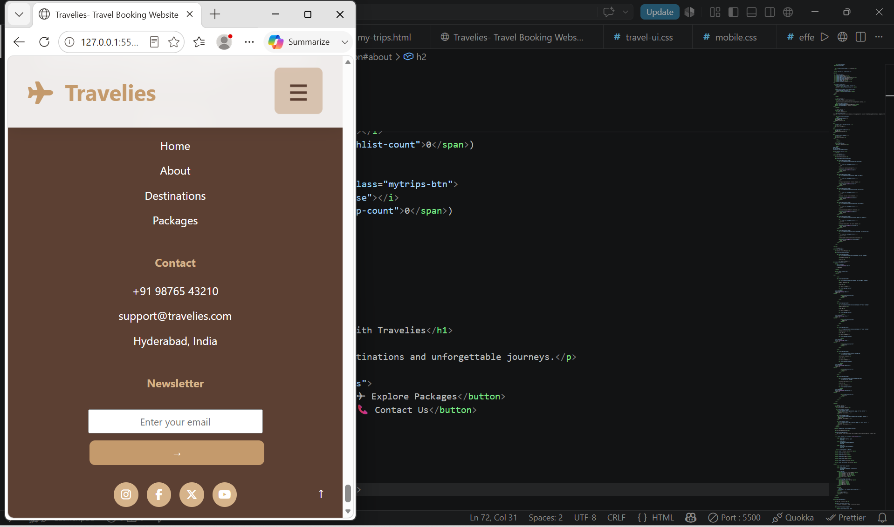

### Tablet View
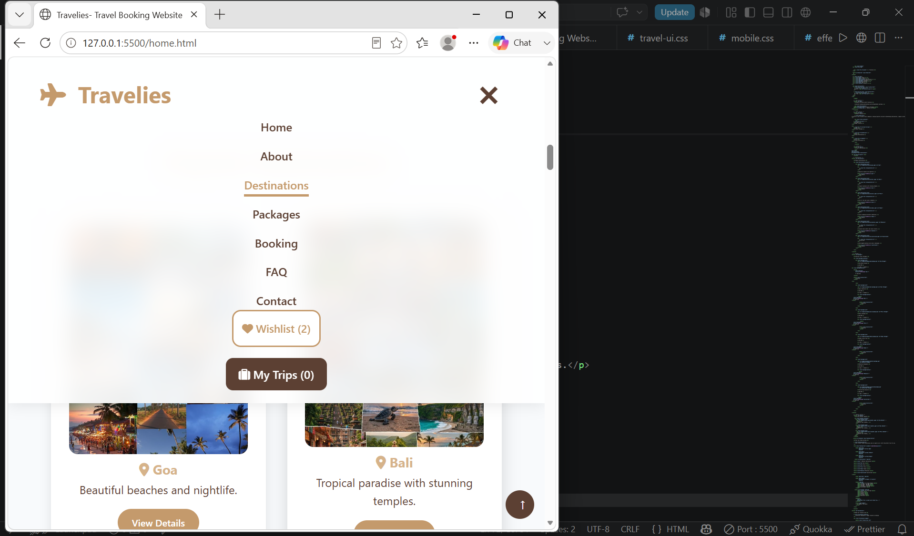

---

## 🎯 Key Learning Outcomes

Through this project, I gained hands-on experience in:

- Responsive Web Design
- DOM Manipulation
- JavaScript Event Handling
- Local Storage Management
- UI/UX Design Principles
- Mobile-First Development
- Git & GitHub Workflow

---

## 🔮 Future Enhancements

- User Authentication
- Payment Gateway Integration
- Backend Integration
- Travel Recommendation System
- User Profiles
- Booking History Database
- Dark Mode Support

---

## 👩‍💻 Author

**Meghana Paradeshi**

B.Tech Student | Cloud Engineer Aspirant | Frontend Developer
https://github.com/Meghana1125-ui/travelies-travel-booking-website

---

## ⭐ Support

If you like this project, consider giving it a ⭐ on GitHub.

---

### Thank You for Visiting Travelies! ✈️🌍
